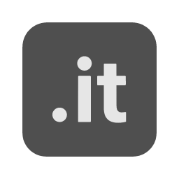

<p align="center">
  
</p>

<h1 align="center">IntentText (.it)</h1>

<p align="center">
IntentText — known as .it — is a structured document language<br>
for humans and AI agents.
</p>

<p align="center">
  <a href="https://itdocs.vercel.app">Docs</a> ·
  <a href="https://intenttext-hub.vercel.app">Hub</a> ·
  <a href="https://iteditor.vercel.app">Editor</a> ·
  <a href="https://npmjs.com/package/@intenttext/core">npm</a> ·
  <a href="https://pypi.org/project/intenttext/">PyPI</a> ·
  <a href="https://x.com/IntentText">Twitter</a>
</p>

---

Your documents are your most important assets. Right now they are
trapped in formats you cannot query, cannot version, cannot verify,
and cannot own. IntentText makes every document a structured record
your systems can read, your people can write, and your lawyers can trust.

What you actually built is this: a format where documents are alive.
They can be queried, merged, tracked, signed, verified, and read by
both humans and machines. Word documents are dead — they exist to be
printed and forgotten. .it files are alive — they exist to be used.

---

## The Format

Each line is one intent. One keyword. One meaning.

```
title: Service Agreement
summary: Consulting services Q2 2026
meta: | client: Acme Corp | ref: CONTRACT-2026-042
track: | version: 1.0 | by: Ahmed

section: Scope
note: Consulting services April–June 2026
note: Value: USD 24,000 | weight: bold
deadline: Payment due | date: 2026-04-30 | consequence: Late fee applies

section: Parties
contact: Ahmed Al-Rashid | role: CEO | email: ahmed@acme.com
contact: James Miller | role: COO | email: j.miller@client.co

section: Definitions
def: Force Majeure | meaning: Events beyond the reasonable control of either party

approve: Reviewed by legal | by: Sarah Chen | role: Legal Counsel
sign: Ahmed Al-Rashid | role: CEO | at: 2026-03-06T14:32:00Z
freeze: | status: locked
```

Human readable. Machine queryable. Agent executable.

---

## The Trust System

> You own the format. The user owns the file.
> The CLI is what gives the file trust — not what gives it existence.
>
> A .it file without the CLI is still a document.
> A .it file with the CLI is a document with a verifiable history
> and a trustworthy audit trail.

---

## Install

```bash
npm install @intenttext/core
```

```bash
pip install intenttext
```

---

## Ecosystem

**@intenttext/core** — TypeScript/Node.js parser, renderer, and CLI.
**intenttext** — Python package (PyPI).
**intenttext-mcp** — MCP server for AI agents and LLM clients.
**intenttext-vscode** — VS Code extension with syntax highlighting and snippets.
**Hub** — Template and theme registry. 76 curated templates, 8 built-in themes.
**Editor** — Web editor with live preview and theme picker.

---

## Docs

Everything is at [itdocs.vercel.app](https://itdocs.vercel.app) —
guide, reference, cookbook, ecosystem, and the full specification.

---

## Roadmap

**v2.x** — Docs site, ecosystem polish, community templates.

**v3.0** — Rust core compiled to WebAssembly. Single binary runs in
Node.js, browser, Python (via PyO3), and any language with WASM support.
All current language packages become thin wrappers. Same format. Same files.
No migration.

---

## License

MIT
